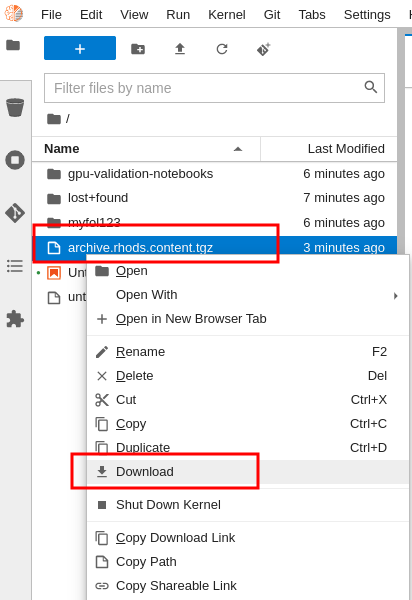
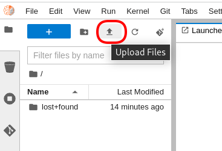
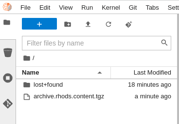

# Export/Import JupyterHub Content

These instructions are a quick and simple way of capturing your content from your persistent volume in one RHODS environment and moving it to to another.

They will refer to a **Source** environment and a **Target** environment. Make sure to keep in mind which is which so that your migration goes in the right direction.

## Tar the content

Although JupyterLab lets you download files, it's more efficient to package them up in a single file first.

1. When logging into the Source environment, make sure to use the
   1. **Small** as the size of the container
   1. **Standard Data Science** as the image
1. Create a new Notebook
1. In the first cell, past this code:

    ```bash
    ! cd ~ ; tar --exclude='archive.rhods.content.tgz' -zcvf archive.rhods.content.tgz .
    ```
1. Execute the cell
1. A new file called `archive.rhods.content.tgz` is created and visible in your file manager

## Download tar file (from Source environment)

1. Select it and download it:

    

1. Ensure you know where the file got saved

## Upload tar file (to Target environment)

1. Once the download is done, connect to the Target environment
1. When logging into the Target environment, make sure to use the
   1. **Small** as the size of the container
   1. **Standard Data Science** as the image
1. Normally, this new environment should be void of content.
1. Click on the upload icon:

    

1. Select and upload the file called `archive.rhods.content.tgz`
1. Confirm it's there:

    

## Untar the file

In order to extract the content out of this file,

1. Create a new notebook
1. In the first cell, execute:

    ```bash
    ! cd ~ ; tar -xvf archive.rhods.content.tgz
    ```

1. This should have restored your content into the new (Target environment.)

## Clean up

1. And in a new  cell,  and execute :

    ```bash
    ! cd ~ ; rm archive.rhods.content.tgz
    ```


